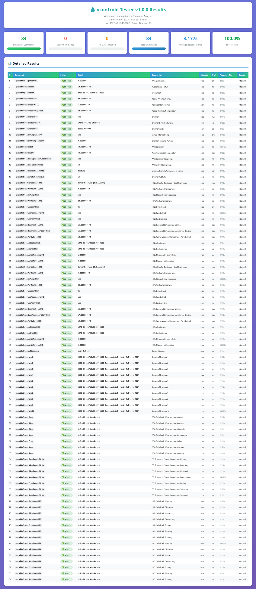
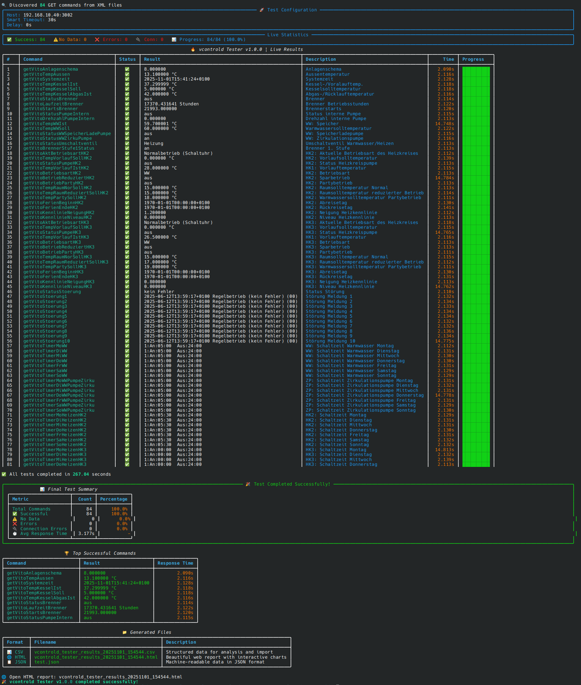

_NOTE: These changes were made with the help of AI_

## vcontrold Tester v1.0.0

A comprehensive Python testing tool for vcontrold daemon that discovers and tests heating system commands with live monitoring capabilities.

    
    

### Features

**Command Discovery**
- Automatically discovers GET commands from `vito.xml` and `vcontrold.xml` configuration files
- Supports custom XML file paths

**Multiple Output Formats**
- CSV export
- JSON export
- HTML report

### Installation

Install required dependencies:

    pip install rich

Optional: The tool works without Rich but provides a simpler table interface.

### Usage

**Basic Usage**

Test all commands with default settings (host: 127.0.0.1; port: 3002):

    python vcontrold_tester_v1.0.0.py

**Custom Host and Port**

Connect to a remote vcontrold instance:

    python vcontrold_tester_v1.0.0.py --host 192.168.1.100 --port 3002

**Debug Mode**

Enable detailed logging to console and file:

    python vcontrold_tester_v1.0.0.py --debug

**Simple Table Mode**

Use basic table output (no Rich formatting):

    python vcontrold_tester_v1.0.0.py --simple

**Custom XML Configuration**

Specify alternative XML configuration files:

    python vcontrold_tester_v1.0.0.py --vito-xml /path/to/vito.xml --vcontrold-xml /path/to/vcontrold.xml

**Adjust Timing**

Change timeout and delay between commands:

    python vcontrold_tester_v1.0.0.py --timeout 60 --delay 1.0

**Export Results**

Specify custom output filenames:

    python vcontrold_tester_v1.0.0.py --csv-output results.csv --json-output results.json --html-output report.html

### Command Line Arguments

    --host HOST               Hostname/IP of vcontrold (default: 127.0.0.1)
    --port PORT               Port number (default: 3002)
    --timeout TIMEOUT         Command timeout in seconds (default: 30)
    --delay DELAY             Delay between commands (default: 0.5)
    --vito-xml PATH           Path to vito.xml (default: vito.xml)
    --vcontrold-xml PATH      Path to vcontrold.xml (default: vcontrold.xml)
    --csv-output FILE         CSV output filename
    --json-output FILE        JSON output filename
    --html-output FILE        HTML output filename
    --debug                   Enable debug logging
    --simple                  Use simple table mode

### Output Files

**Automatic Log File**

A timestamped log file is created for each run:

    vcontrold_tester_YYYYMMDD_HHMMSS.log

**CSV Output**

Contains columns: command, address, length, unit, description, status, result, execution_time, timestamp, source

**JSON Output**

Structured JSON array with all test results and metadata

**HTML Output**

Interactive HTML report with:
- Summary statistics dashboard
- Color-coded status indicators
- Sortable/searchable results table
- Execution time charts

### Architecture

**VcontroldCommandDiscoverer Class**
Handles XML parsing and command discovery:
- `discover_commands()` - Main entry point for command discovery
- `_parse_vito_xml()` - Parses vito.xml for command definitions
- `_parse_vcontrold_xml()` - Parses vcontrold.xml for additional commands

**VcontroldTester Class**

Main testing engine with:
- `test_connection()` - Validates connection to vcontrold daemon
- `execute_command()` - Executes single command with proper timeout handling
- `test_all_commands()` - Runs full test suite with live display
- `save_results()` - Exports to CSV
- `save_json_results()` - Exports to JSON
- `save_html_results()` - Generates HTML report

### Safety Features

**Read-Only Operations**
- Only executes GET commands (read operations)
- Filters out SET commands that could modify system settings
- Excludes bare protocol commands like 'getaddr', 'setaddr'

**Connection Handling**
- Automatic timeout to prevent hanging connections
- Smart detection of complete responses
- Graceful error handling for connection failures

**Debug Logging**
- All operations logged to timestamped file
- Optional console debug output
- Full request/response capture

### Requirements

- Python 3.6+
- rich library (optional, for enhanced UI)
- vcontrold daemon running and accessible
- vito.xml configuration file

### Troubleshooting

**No commands discovered**

Ensure vito.xml is in the current directory or specify path with --vito-xml

**Connection refused**

Verify vcontrold is running and accessible at specified host:port

**Timeouts**

Increase timeout value with --timeout or check network connectivity

**Missing Rich formatting**

Install with: pip install rich or use --simple mode
