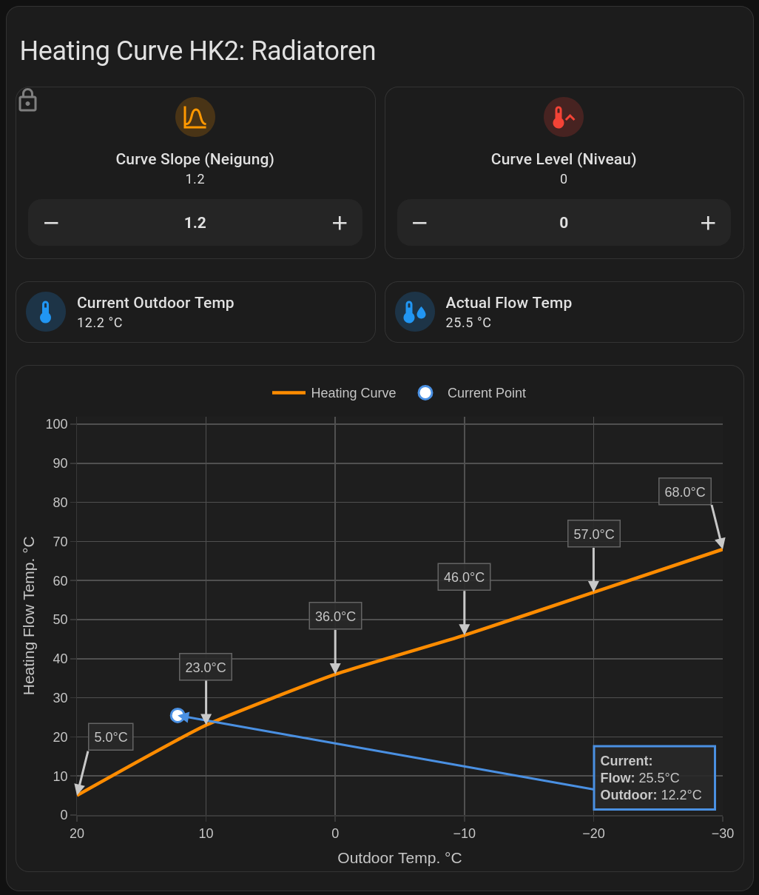

_NOTE: Description & configuration were made with the help of AI_

# Home Assistant Heating Curve Card for Viessmann Vitodens 200-W

This Lovelace card configuration provides an interactive visualization and control interface for Viessmann Vitodens 200-W heating curve parameters.

    <h1>Preview</h1>
    

## Overview

The card displays a dynamic heating curve graph that shows the relationship between outdoor temperature and the required heating flow temperature. Users can adjust the curve slope (Neigung) and level (Niveau) parameters, with real-time visualization of how these changes affect the heating curve.

## Note 
- These configurations are designed for heating circuit 2 (HK2) (Radiatoren) & heating circuit 3 (HK3) (Bodenheizung) and not for heating circuit 1 (HK1) since my configuration does not include HK1.
- Always check your own configuration and adapt entity names accordingly to ensure compatibility.

## Card Structure

The configuration uses a vertical stack containing:

1. **Title Section**: Mushroom-style title card identifying the heating circuit
2. **Control Section**: Protected by a restriction card requiring 30-second confirmation
   - Slope adjustment (Neigung): Controls the steepness of the heating curve
   - Level adjustment (Niveau): Shifts the entire curve up or down
3. **Status Section**: Current readings display
   - Outdoor temperature sensor
   - Actual flow temperature sensor
4. **Visualization Section**: Interactive Plotly graph with heating curve

## Required Entities

The card requires these Home Assistant entities to be configured. _The names may vary depending on your configuration_:

    select.mqtt_hk2_neigung_heizkennlinie        # Heating curve slope selector (0.2 - 3.5)
    select.mqtt_hk2_niveau_heizkennlinie         # Heating curve level selector (integer offset)
    sensor.mqtt_aussentemperatur                 # Outdoor temperature sensor
    sensor.hk2_radiatoren_hk2_voralauftemperatur # Radiator flow temperature sensor

## Required Custom Cards

Install these custom cards via HACS:

- **vertical-stack-in-card**: Container for nested cards
- **mushroom**: Modern card designs (title-card, number-card, entity-card)
- **restriction-card**: Adds confirmation dialogs to prevent accidental changes
- **layout-card**: Grid layout support
- **plotly-graph**: Advanced graph visualization

## Installation

1. Install all required custom cards through HACS
2. Ensure all entities listed above exist in your Home Assistant configuration
3. Copy-paste the YAML configuration to your Lovelace dashboard
4. Adjust entity names if your setup has different naming conventions

## Features

### Heating Curve Calculation

The card includes a comprehensive heating curve lookup table with 30 slope values (0.2 to 3.5) and 6 outdoor temperature points (-30°C to +20°C). The calculation uses linear interpolation between known slope values to provide smooth curve adjustments.

### Dynamic Annotations

- Temperature values are displayed at key points along the curve
- Annotations automatically reposition to avoid overlap at chart edges
- High temperature values (>85°C) show annotations below the point
- Responsive design shows fewer annotations on narrow screens

### Current Position Indicator

A white marker with blue border shows the current operating point based on actual outdoor and flow temperatures, with a detailed annotation box showing:

- Current flow temperature
- Current outdoor temperature
- Dynamic positioning (top-right or bottom-left based on curve parameters)

### Interactive Elements

- **Button Mode Controls**: Slope and level can be adjusted using increment/decrement buttons
- **Tap Actions**: Tap any control for more detailed information
- **Confirmation Protection**: 30-second window after activating change mode prevents accidental adjustments

### Graph Specifications

- X-axis: Outdoor temperature from +20°C to -30°C (reversed)
- Y-axis: Flow temperature from 0°C to 102°C
- Grid spacing: 10°C increments on both axes
- Smooth spline interpolation for curve rendering
- Fixed ranges prevent accidental zoom/pan
- Dark theme optimized colors

## Customization

### Adjusting Temperature Ranges

To modify the outdoor temperature range, update these sections:

    x: [20, 10, 0, -10, -20, -30]  # Adjust values as needed
    range: [20, -30]                # Update x-axis range accordingly

### Modifying Heating Curve Data

The `heatingCurveData` object contains the lookup table. To add custom slope values or temperature points, extend this object following the existing pattern:

    const heatingCurveData = {
      0.2: {'-30': 24, '-20': 22, '-10': 20, '0': 18, '10': 16, '20': 13},
      // Add more slope values...
    };

### Color Scheme

Colors can be adjusted in multiple sections:

- Curve line: `color: rgb(255, 140, 0)` (orange)
- Current point marker: `color: rgb(255, 255, 255)` with `line.color: rgb(74, 144, 226)` (white with blue border)
- Background: `plot_bgcolor: rgb(30, 30, 30)` (dark gray)
- Grid lines: `gridcolor: rgb(80, 80, 80)`

### Layout Customization

Grid layouts use CSS grid template columns:

    grid-template-columns: repeat(2, minmax(120px, 1fr))  # 2-column layout
    grid-gap: 0px                                         # Spacing between items

## Heating Curve Logic

The flow temperature calculation follows this process:

1. Read current slope and niveau (level offset) from select entities
2. Find the two closest slope values in the lookup table
3. Interpolate flow temperature for each outdoor temperature point
4. Add the niveau offset to shift the curve vertically
5. Clamp final values between 0°C and 100°C

Formula: `FlowTemp = InterpolatedValue(slope, outdoorTemp) + niveau`

## Responsive Behavior

The card detects screen width and adjusts annotation density:

- Wide screens (≥768px): Shows annotations for all temperature points
- Narrow screens (<768px): Shows annotations for every other point

## Troubleshooting

**Graph not displaying**: Verify that custom:plotly-graph card is installed

**Entity unavailable errors**: Check that all sensor and select entities exist and are properly named

**Annotations overlapping**: This is handled automatically, but can be adjusted by modifying the `ax` and `ay` offset values in the annotations function

**Changes not applying**: Ensure restriction-card confirmation is activated by clicking the control area first

## Technical Notes

- The card uses JavaScript template functions (`$fn`) for dynamic calculations
- All computations run client-side in the browser
- Graph updates automatically when entity states change
- Refresh interval: 5 seconds for real-time updates
- Hours to show: 1 (required parameter, though data is not historical)
